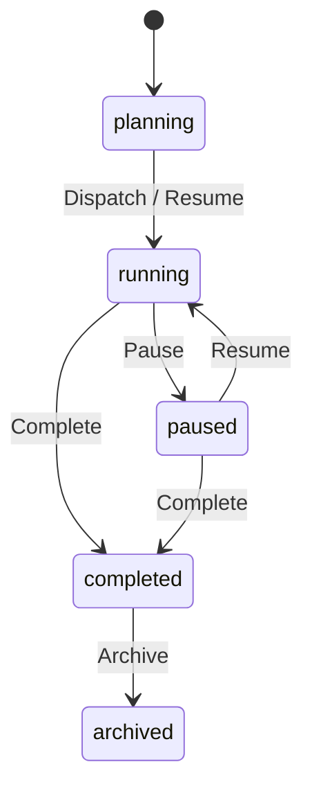

# Constellation Engine

`engine/constellation.ts` decides commands without I/O. Its XState lifecycle is reconstructed from the folded event log; Task readiness and Gate fan-in are projections. Plans validate the whole candidate graph and return all findings without committing any mutations on refusal. Task and Attempt revisions protect edits and reviews; graph revisions advance per graph event.

The owner commits through `Constellations.command(binding, commandId, command)`. Bindings come from authenticated Desktop connections or role-bound MCP tools. Workers may mutate their latest active Attempt; the current Lead and user manage the graph. Approval is user-only, hand-up is Lead-only, and both keep the Claim in Review. Accept requires the exact claimed head. Verified receipts resolve to recorded, completed, successful command output; reported prose alone cannot become verified evidence.

`ConstellationRuntime.prepare` supplies provisioned Attempts, the git Claim probe, recorded remote checks and handover placement before the serialized decision. Preparation receives the command ID as its fourth argument and must retain its placement on command retries. `afterCommit` runs only for a newly committed receipt. W/L own preparation, transfer and delivery; the Engine owns the Session machine and Turn commits.

`workingAttemptsLayer` acquires FIFO Host worker slots after `AttemptStarted`. Each working Attempt has a scope, closed on Claim, rejection, acceptance, settlement or Daemon shutdown. A canceled queued Attempt cannot start. Its committed-event callback replays startup history and resumes after a bounded subscription closes; it includes session archive events. The Host composition helper captures HostResources and MCP tokens; the injected startup callback commits the title and submits H's first prompt through the Session machine, passing the attachment on start and resume. `hostWorkingAttemptsLayer` passes `POLARIS_HOST_SOCKET`, `POLARIS_SESSION_ID` and optional `POLARIS_BINARY` as the startup callback's second argument; relay them to worker environment setup. After Session recovery, L calls `ConstellationRuntime.resumeWorking()` to reacquire slots for folded working Attempts. It calls the separate injected `resumeWorker` once per assignment. Composition submits the first Turn only when the persisted `${attempt.id}:start` command receipt is absent, including an Initial Attempt committed before a crash. Existing startup receipts survive the bounded recent-Turn window; L owns the journaled recovery Continue. No polling or idle timer is added.

`decideConstellationJournal` accepts trusted delivery/recovery inputs. A digest, recovery Continue or silent-end nudge requires its matching Session-machine `TurnStarted` in the same commit. Recovery and nudging have durable once-per-Attempt markers. Delivery consumes pending notification IDs once and targets the current Lead; pause retains pending IDs. Journal context requires the observed offline session IDs and explicit-command flag; an offline worker cannot settle mechanically. Settlement callers also include this context when exporting replay traces.

`constellation.defaults.get/set` persist `ConstellationSettings` atomically in `constellation-settings.json` on each Host. The Desktop App broadcasts the user-level setting to connected Hosts. An omitted `plan.start.settings` snapshots these defaults into the new graph; later settings changes do not rewrite existing graphs. `ConstellationDefaultsPath` isolates tests from the real Host settings.

Graph subscriptions subscribe before their cut, replay indexed graph events, then emit synchronized live events beyond the cut. New Claim metadata event tags require `constellation.claim-review`; optional Attempt fields still decode when absent. Defaults RPCs require `constellation.defaults`. The pure Task projection leaves liveness unknown. `ConstellationLiveness.layer` enriches status and snapshots, restores recorded output/context on first read, and seeds `LivenessChanged` on resume for Clients announcing `constellation.liveness`. Composition calls `observe(sessionId, HarnessEvent, epochMs, queuedInput?)` after normalized Harness observations and `queued(sessionId, count)` after delivery queue changes. Updates are bounded and ephemeral, have no sequence, and do not advance graph revisions. A reused session supplies facts only to its latest assignment. No timing is invented for unfinished tools after restart.

Verification covers lifecycle paths, full-batch validation, roles/revisions/refusals, evidence, restart folds, concurrent edits, subscription cuts, FIFO scope release and an independent randomized reference fold. `POLARIS_TRACE_DIR=/tmp/constellation-traces bun test apps/daemon/src/verification/constellation*.test.ts` emits complete committed traces. Replay with `bun packages/spec/scripts/replay-constellation.ts /tmp/constellation-traces`.

The reference fold and decider traces abstract live reads: observational updates
are tested separately and never appear in committed-log replay. The default
runtime does not provision Worktrees or start vendor processes. W/L must provide
its preparation/startup callbacks and connect the liveness producer to their
normalized Harness drain and durable delivery queue.
