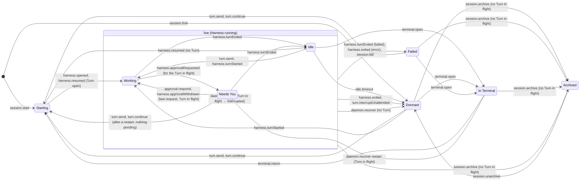

# Engine

The orchestration engine: `decider.ts` validates Client commands, `Engine.ts` commits them and supervises each Agent Session's Harness. The store and the rest of the engine are described in `../store/README.md`; this page is about the **Agent Session lifecycle machine** (`session.ts`, ENG-210).

## The session machine

Everything that moves a Session State goes through one XState statechart, `sessionMachine` (`xstate@6.0.0-alpha.61`, pinned exactly). It is used as a **pure decider**, never as a live actor:

```
record (folded from the log) ─▶ snapshotOf(record) ─▶ transition(machine, snapshot, input) ─▶ emitted:
                                                                                               domain   → commit these DomainEvents
                                                                                               rejected → CommandRejected(reason)
                                                                                               effect   → run after commit
```

- **The event log stays the source of truth.** `snapshotOf(record)` derives the machine snapshot from the folded `SessionRecord` (the Session State is the state value, the record is the context), so a restart rebuilds it by folding events, as it always did. Nothing keeps a snapshot between inputs.
- **The context update is the fold.** A transition emits its `DomainEvent`s and moves to the state `foldSession` of those events gives (`store/model.ts`, the same reducer `project` uses). So a transition's next snapshot is exactly what the log folds to once its events commit, and the target state and the recorded `SessionStateChanged` can't disagree. `session.test.ts` checks this for every reachable snapshot and input.
- **Inputs** (`SessionInput`) are Client commands, validated (a state that doesn't accept one rejects it with the reason a user reads), and engine signals from the reactors: the Harness (`harness.opened`, `harness.turnStarted`, `harness.approvalRequested`, `harness.turnEnded`, `harness.exited`, …), the terminal hand-off (`terminal.closed`, `harness.resumed`), the idle timer (`idle.timeout`), failures (`session.fail`) and restart / upgrade recovery (`daemon.recover`). Their payloads are Effect Schemas passed to XState as Standard Schemas (`Schema.toStandardSchemaV1`), which types every handler's `event`.
- **Effects**: entering Idle emits `scheduleIdleStop` (the engine arms the idle timer); `idle.timeout` emits `stopHarness`. Everything else the reactors do (opening Harnesses, checkpoints, Worktrees) stays in `Engine.ts`, keyed off the command or Harness event as before.
- **Where it runs**: `decider.ts` builds the input for each lifecycle command (`StartSession`, `SendTurn`, `Continue`, `Steer`, `Interrupt`, `RespondToApproval`, `SetPermissionMode`, `ForkSession`, `ArchiveSession`, `UnarchiveSession`, `OpenInTerminal`, `ReturnFromTerminal`) and returns what the machine emits; `Engine.ts`'s `signal(sessionId, input)` does the same for engine signals inside `store.commit`, then runs the effects. Workspaces, Worktrees, renames and Turn items are not lifecycle and stay where they were.
- **Cost**: one `resolveState` + `transition` is ~10 µs, and snapshots are cached per record (`WeakMap`), so a record is resolved once. Deltas and item events never touch the machine.

How XState v6 transition functions read in `session.ts`: returning `undefined` means "not taken" and the event bubbles to the machine-level default (usually a rejection); returning an object takes the transition, even `HANDLED` (no target), which is how a state ignores a signal. A state change targets `#<state>` with `reenter: true`, so an entry action runs for every recorded `SessionStateChanged`.



Not drawn: `starting`, `dormant` and `failed` also take `harness.approvalRequested` (→ Needs You) and `harness.turnEnded` (→ Idle or Failed) like the live states, and every state but Archived takes `session.fail` (→ Failed) and `turn.interruptUnattended` (→ Dormant). Every state ignores `harness.approvalRequested` for a Turn that is not the Turn in flight (one that ended, a stale or misbehaving Harness), as every state ignores `harness.turnEnded` for a Turn that is not working. So an approval is pending only while its Turn is in flight, and a session is Working only with a Turn in flight (ENG-209, findings 2 and 3).

### Guards (illegal transitions are refused)

| Input | Accepted in | Refused with |
|---|---|---|
| `turn.send` | Idle (→ Working), Dormant, Failed, Needs You after a restart with nothing pending (→ Starting); never with a Turn in flight | "the session is Archived", "… In Terminal; return it first", "the session is working; wait for the Turn to end" |
| `turn.continue` | the same states, and only when the last Turn is Interrupted | "there is no Interrupted Turn to continue", "the session is \<state\>" |
| `turn.steer` / `turn.interrupt` | a Turn in flight (steer: not In Terminal, and the Harness supports it) | "there is no Turn in flight …" |
| `approval.respond` | a pending request (the last answer in Needs You → Working, if a Turn is in flight) | "request … is already resolved" (first Client wins) |
| `session.archive` | any state but Archived, only with no Turn in flight (withdraws anything still pending) | "interrupt the Turn in flight before archiving", "already Archived" |
| `terminal.open` / `terminal.return` | Idle, Dormant, Failed / In Terminal | "the session is \<state\>" / "not In Terminal" |
| `session.start` / `session.fork` | before the session exists | "session … already exists" |

### Terminal hand-off

`terminal.open` moves to In Terminal in both cases; the difference is in the engine. Codex (`liveCoAttach`) keeps its Harness: the TUI co-attaches, its Turns arrive as `harness.turnStarted` / `harness.turnEnded` and change no state while In Terminal. Claude hands off sequentially: the engine stops the Harness and follows the TUI's hooks, which report the same signals. `terminal.return` → Starting; for Claude the engine first sends `terminal.closed` (a Turn the TUI left open ends Interrupted), then reopens the Harness and sends `harness.resumed` (→ Working if a Turn is still open, else Idle).

### Restart recovery

On start the engine sends `daemon.recover` (cause `restart`) to every session; `prepareForUpgrade` sends cause `upgrade` to the sessions whose Harness lives in the Daemon process. The rule: a Turn in flight ends Interrupted and the session Needs You (reason `interrupted`); pending approvals are withdrawn; Failed stays Failed; a Needs You already waiting on Continue stays; other states go Dormant (`daemon-restart` / `daemon-upgrade`). Dormant and Archived have nothing to recover (an Archived session from a log written before Archive refused a Turn in flight has its Turn ended Interrupted and its requests withdrawn, and stays Archived), and an upgrade leaves In Terminal alone. **Nothing ever continues a Turn automatically**: only `turn.continue` does, and only the user sends it.

### Changes from the pre-machine engine

Deliberate, and only in races the old code let through: Archived now ignores what a Harness still being stopped reports (a new Turn, an approval request, an exit, a failure) and an unattended interrupt ends its Turn without leaving Archived. Before, those could move an Archived session to Needs You, Idle, Failed or Dormant without Unarchive. Everything else emits the same events in the same order.

### Changes from ENG-209's findings

- Archive is refused while a Turn is in flight in every state (Starting, In Terminal, Dormant and Failed too), with the reason the live states already gave. Before, only Idle, Working and Needs You checked, so archiving In Terminal mid-Turn left the Turn `working` and its approvals pending for good (recovery skips Archived). We refuse rather than end the Turn on Archive: Archive never discards a Turn the user may still be watching in the terminal UI, the rule is one guard for every state, and Interrupt (from Polaris or the terminal UI) is always there to end the Turn first.
- `harness.approvalRequested` for a Turn that is not the Turn in flight is ignored, and answering or withdrawing the last request moves to Working only with a Turn in flight. Before, a request that arrived after its Turn ended put the session in Needs You with no Turn, and answering it left it Working with no Turn, refusing new Turns until a restart.
- The graph counts dropped (35 → 29 and 41 → 35 states, 149 → 127 and 196 → 174 transitions): the states "Archived with a Turn in flight" (and pending approvals) are gone.

## Model-based tests

`session.testing.ts` wraps the machine in a test model for `xstate/graph`: abstract Steps a test can also drive against the real Engine (a command, something the fake Harness or the followed terminal UI reports, a Daemon restart), each followed by what the Engine then does on its own (opening the Harness, resuming it after the terminal, the fake's reply to an interrupt), plus whether a Harness process is running. `session.graph.test.ts` replays every generated path against the real Engine and the fake Harness (`testing.ts`), once with a Claude-like driver (sequential hand-off, terminal follower) and once with a Codex-like one (live co-attach). After every step the Engine's session (Session State, Turn in flight, last Turn status, pending approvals, Harness running) must equal the machine's; at the end of every path each command the machine refuses must be refused by the Engine with the same reason, and a late approval request (for a Turn that ended) must change nothing in either.

| Driver | States (shortest paths) | State-changing transitions (one path each) |
|---|---|---|
| Claude (sequential hand-off) | 29 | 127 |
| Codex (live co-attach) | 35 | 174 |

Simple paths are too many to replay (455k and 2.4M), so every transition is covered instead. Not replayed: `idle.timeout` (the Engine's timer; covered by `Engine.test.ts`) and `session.fail` (a failing Worktree or Harness open). `session.test.ts` checks the machine on its own: all eight Session States are reachable, the rebuild-from-fold property, the guards, recovery and effects.

When you change the lifecycle: change `session.ts`, then `session.testing.ts` if a new Step or Engine follow-up is needed, update the counts above and in `session.test.ts`, and keep this diagram in step.
