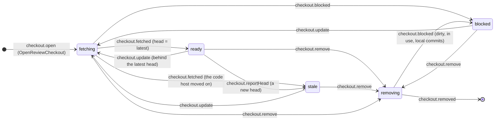

# Engine

The orchestration engine: `decider.ts` validates Client commands, the `Engine` service (`Engine.ts`) commits them and supervises each Agent Session's Harness. The store and the rest of the engine are described in `../store/README.md`; this page is about the **Agent Session lifecycle machine** (`session.ts`, ENG-210). Why it is a pure decider: `docs/adr/0006-the-session-machine-is-a-pure-decider.md`.

## Modules

`Engine.ts` is the module's interface (the `Engine` service, `EngineConfig`) and wires the parts, each an internal service built once per `Engine.layer`:

| Module | What |
|---|---|
| `runtime.ts` | `EngineRuntime`: the shared state (running Harnesses, terminal followers, live item progress, idle timers, per-session locks) and primitives: `serially`, `recordFor`, `signal` / `signalWith` (one machine input, committed, then its effects), `failSession`, `capture`, `stopHarness`, `findTurn`. |
| `supervisor.ts` | `Supervisor`: opens Harnesses, hands them Turns (`runTurn`, with a Fork's preamble), and maps `HarnessEvent`s to domain events and machine inputs. An approval first goes to the optional `ApprovalPolicy` (`services.ts`; the Reviewer's read-only sessions, `../reviewer/`), which may answer it on the live Harness so it never reaches Needs You or the log. |
| `terminal.ts` | `TerminalHandoff`: `OpenInTerminal` / `ReturnFromTerminal`, and following Claude's TUI while In Terminal. |
| `worktrees.ts` | `Worktrees`: detection on register, creation for `NewWorktree` and Forks, removal on Archive, restore on Unarchive. |
| `pruning.ts` | `CheckpointPruning`: the policy on Archive, a removed Workspace's checkpoints, and the sweeper's targets. |
| `context.ts` | Which `ContextUsed` reports become `SessionContextUsed`: the first, a new window, or a move of a whole percent (a thousand tokens while the window is unknown). |
| `reactors.ts` | `Reactors`: what runs after each command commits. |
| `dispatch.ts` | `Dispatcher`: resolves the decider's inputs, commits, acks and forks the reactor. |
| `sessionBoundary.ts` | A shared per-Session gate for Constellation startup and incoming Turn commands. A committed Attempt with no first-Turn receipt starts before queued inputs; remote mirror revisions also wake waiters. Queued `SendTurn` waits for the brief’s boundary. Harness brief submission finishes under the startup gate. User Steer bypasses that fence to reach the running Turn; new prompts queued by startup use a separate FIFO through readiness and commit. Later prompts join while any queued Turn is active; its TurnEnded removes queue mode. Ordinary busy commands outside that queue retain their existing refusal. Waiters subscribe to their Session only, with internal graph-lifecycle wakes; Client feeds are unchanged. Durable startup-failed receipts remove the fence after setup failure, even after manual repair or Retry. |
| `streams.ts` | `Streams`: the Host and session streams (snapshot or replay, `Synchronized`, live). |
| `review.ts` | The decider's Review commands: `SendFeedback` and `AcceptTurns` through the session machine, the Review Checkout commands through the checkout machine, `LinkPullRequest`, `RecordVerdict`. |
| `checkout.ts` | The Review Checkout lifecycle machine (below). |
| `reviewCheckouts.ts` | `ReviewCheckouts`: the git side of the checkout commands (through `ReviewCheckoutGit`), the signals back to the machine, recovery after a restart, `review.checkoutStatus`, and `reviewed` for the Reviewer (`Engine.checkoutReviewed`). A session placed `ReviewCheckout` (the Reviewer's) works in a checkout's directory. |
| `recovery.ts` | `daemon.recover` on start and before an upgrade (`docs/adr/0004-restart-recovery-never-continues-a-turn.md`). |

## The session machine

Everything that moves a Session State goes through one XState statechart, `sessionMachine` (`xstate@6.0.0-alpha.61`, pinned exactly). It is used as a **pure decider**, never as a live actor:

```
record (folded from the log) ─▶ snapshotOf(record) ─▶ transition(machine, snapshot, input) ─▶ emitted:
                                                                                               domain   → commit these DomainEvents
                                                                                               rejected → CommandRejected(reason)
                                                                                               effect   → run after commit
```

- **The event log stays the source of truth.** `snapshotOf(record)` derives the machine snapshot from the folded `SessionRecord` (the Session State is the state value, the record is the context), so a restart rebuilds it by folding events, as it always did. Nothing keeps a snapshot between inputs.
- **The context update is the fold.** A transition emits its `DomainEvent`s and moves to the state `foldSession` of those events gives (`store/model.ts`, the same reducer `project` uses). So a transition's next snapshot is exactly what the log folds to once its events commit, and the target state and the recorded `SessionStateChanged` can't disagree. `session.test.ts` checks this for every reachable snapshot and input.
- **Inputs** (`SessionInput`) are Client commands, validated (a state that doesn't accept one rejects it with the reason a user reads), and engine signals from the reactors: the Harness (`harness.opened`, `harness.turnStarted`, `harness.approvalRequested`, `harness.turnEnded`, `harness.exited`, …), the terminal hand-off (`terminal.closed`, `harness.resumed`), the idle timer (`idle.timeout`), failures (`session.fail`) and restart / upgrade recovery (`daemon.recover`). Their payloads (`session.inputs.ts`, with what the machine emits) are Effect Schemas passed to XState as Standard Schemas (`Schema.toStandardSchemaV1`), which types every handler's `event`.
- **Effects**: `turn.deliver` emits `waitForTurn` when another Turn is working; the deferred input lane runs that effect outside the reactor lock. The runtime commits signal events and runs stop/idle effects before returning wait effects to the lane. Entering Idle emits `scheduleIdleStop`. The runtime uses `idleTimeout` (30 minutes by default) without background work, or `backgroundIdleTimeout` (eight hours by default) while waiting. Silent background work counts as idle. Recorded session events and streamed progress update a monotonic last-event timestamp; one timer sleeps again for the remaining inactivity interval. Expiry passes through `idle.timeout`, clears background work, stops the Harness and records Dormant with reason `background-idle-timeout`; ordinary expiry records `idle-timeout`. Membership changes re-arm the appropriate timer. Everything else the reactors do (opening Harnesses, checkpoints, Worktrees) stays in the reactors and the supervisor, keyed off the command or Harness event as before.
- **Where it runs**: `decider.ts` builds the input for each lifecycle command (`StartSession`, `SendTurn`, `Continue`, `Retry`, `Steer`, `Interrupt`, `RespondToApproval`, `SetPermissionMode`, `SetModel`, `ForkSession`, `ArchiveSession`, `UnarchiveSession`, `OpenInTerminal`, `ReturnFromTerminal`) and returns what the machine emits; the runtime's `signal(sessionId, input)` (`runtime.ts`) does the same for engine signals inside `store.commit`, then runs the effects. Workspaces, Worktrees, renames and Turn items are not lifecycle and stay where they were.
- **Cost**: one `resolveState` + `transition` is ~10 µs, and snapshots are cached per record (`WeakMap`), so a record is resolved once. Deltas and item events never touch the machine.

```mermaid
stateDiagram-v2
  direction LR
  state "Starting" as starting
  state "Needs You" as needs_you
  state "In Terminal" as in_terminal
  state "Dormant" as dormant
  state "Failed" as failed
  state "Archived" as archived
  state "live (Harness running)" as live {
    state "Idle" as idle
    state "Working" as working
    idle --> working: turn.send, turn.deliver, turn.retry, harness.turnStarted (including background reports)
    working --> needs_you: harness.approvalRequested (for the Turn in flight)
    needs_you --> working: approval.respond, harness.approvalWithdrawn (last request, Turn in flight)
    working --> working: turn.send (autonomous Turn: steer user prompt)
    working --> working: turn.deliver (waitForTurn effect; no events)
    working --> idle: harness.turnEnded
    needs_you --> idle: harness.turnEnded
  }
  [*] --> starting: session.start
  [*] --> dormant: session.fork
  starting --> working: harness.opened, harness.resumed (Turn open)
  starting --> idle: harness.resumed (no Turn)
  dormant --> starting: turn.send, turn.deliver, turn.continue, turn.retry
  failed --> starting: turn.send, turn.deliver, turn.continue, turn.retry
  needs_you --> starting: turn.send, turn.deliver, turn.continue, turn.retry (after a restart, nothing pending)
  dormant --> working: harness.turnStarted
  idle --> dormant: idle.timeout (ordinary idle or background inactivity cap)
  idle --> in_terminal: terminal.open
  dormant --> in_terminal: terminal.open
  failed --> in_terminal: terminal.open
  in_terminal --> starting: terminal.return
  live --> failed: harness.turnEnded (failed), harness.exited (error), session.fail
  live --> dormant: harness.exited, turn.interruptUnattended
  live --> needs_you: daemon.recover (Turn in flight → Interrupted)
  live --> dormant: daemon.recover (no Turn)
  in_terminal --> needs_you: daemon.recover restart (Turn in flight)
  live --> archived: session.archive (no Turn in flight)
  dormant --> failed: session.setup (failed), daemon.recover (unfinished setup)
  failed --> dormant: session.setup (repaired setup completed)
  idle --> failed: session.setup (failed)
  dormant --> archived: session.archive (no Turn in flight)
  failed --> archived: session.archive (no Turn in flight)
  in_terminal --> archived: session.archive (no Turn in flight)
  archived --> dormant: session.unarchive
```

How XState v6 transition functions read in `session.ts`: returning `undefined` means "not taken" and the event bubbles to the machine-level default (usually a rejection); returning an object takes the transition, even `HANDLED` (no target), which is how a state ignores a signal. A state change targets `#<state>` with `reenter: true`, so an entry action runs for every recorded `SessionStateChanged`.



Not drawn: `model.set` changes no Session State (it records `SessionModelChanged`; each Turn records the session's Model, effort and service tier when it starts). `starting`, `dormant` and `failed` also take `harness.approvalRequested` (→ Needs You) and `harness.turnEnded` (→ Idle or Failed) like the live states, and every state but Archived takes `session.fail` (→ Failed) and `turn.interruptUnattended` (→ Dormant). Every state ignores `harness.approvalRequested` for a Turn that is not the Turn in flight (one that ended, a stale or misbehaving Harness), as every state ignores `harness.turnEnded` for a Turn that is not working. So an approval is pending only while its Turn is in flight, and a session is Working only with a Turn in flight (ENG-209, findings 2 and 3).

### Guards (illegal transitions are refused)

| Input | Accepted in | Refused with |
|---|---|---|
| `turn.send` | Idle (→ Working), Dormant, Failed, Needs You after a restart with nothing pending (→ Starting); a prompt during an autonomous Working Turn steers that Turn | "the session is Archived", "… In Terminal; return it first", "the session is working; wait for the Turn to end" |
| `turn.continue` | the same states, and only when the last Turn is Interrupted | "there is no Interrupted Turn to continue", "the session is \<state\>" |
| `turn.retry` | the same states, and only when the last Turn Failed; a new Turn with its prompt and attachments | "there is no Failed Turn to retry", "the session is \<state\>" |
| `turn.steer` / `turn.interrupt` | a Turn in flight (steer: not In Terminal, and the Harness supports it) | "there is no Turn in flight …" |
| `approval.respond` | a pending request (the last answer in Needs You → Working, if a Turn is in flight) | "request … is already resolved" (first Client wins) |
| `session.archive` | any state but Archived, only with no Turn in flight (withdraws anything still pending) | "interrupt the Turn in flight before archiving", "already Archived" |
| `terminal.open` / `terminal.return` | Idle, Dormant, Failed / In Terminal | "the session is \<state\>" / "not In Terminal" |
| `model.set` (`SetModel`) | no Turn in flight, not In Terminal or Archived; a Harness that can't switch Model mid-session (driver `switchModel: false`) only before it has a cursor. The same Model, effort and service tier again is accepted and records nothing | "the session is \<state\>; wait for the Turn to end", "… In Terminal; return it first", "the session is Archived", "\<harness\> can't switch Model mid-session; fork instead" |
| `session.start` / `session.fork` | before the session exists | "session … already exists" |
| `turns.accept` (`AcceptTurns`) | no Turn in flight, not In Terminal or Archived; a Turn at or after the one already accepted (the same one again records nothing) | "the session is working; wait for the Turn to end", "the Turns through Turn N are already accepted", "… In Terminal; return it first", "the session is Archived" |
| `turn.continue` after `AcceptTurns` | never for an accepted Interrupted Turn (spec finding 4) | "the Interrupted Turn is accepted; send a new Turn instead" |
| `harness.subagentStarted` / `harness.subagentEnded` | a start only for the Turn in flight, once; an end only for an open Subagent (anything else is ignored, never refused) | — |

### Subagents

A Subagent (CONTEXT.md) is a helper the Harness spawns inside a Turn (Claude's Agent tool, a Codex agent thread, an OpenCode child session). The rules, in `session.subagents.ts`:

- `harness.subagentStarted` records `SubagentStarted` only for the Turn in flight, and once per id (like `harness.approvalRequested`). No Session State changes.
- `AgentSession.backgroundTasks` lists live non-ambient tasks as `{ id, kind: "subagent" | "command", description }`. Idle with a nonempty list is waiting on background work. `SessionBackgroundTasksChanged { sessionId, tasks }` replaces membership and is gated by `session.background-tasks`; snapshots include the list. Ordinary idle shutdown is suppressed while tasks or Subagents remain, bounded by the configurable background inactivity timeout. Harness exit, recovery, failure and Archive clear the list. `Subagent.report` carries markdown from `SubagentHandback.message`, with the task notification summary as fallback.
- A parent model call after background task reports emits `harness.turnStarted` with a fresh id, a compatibility prompt label `[Background task continuation]`, and `Turn.trigger = BackgroundTasksReported { tasks: [{ id, kind }] }`. The normal Idle → Working transition records and streams it before its items; its result closes that Turn. IDs in the trigger are CLI task IDs, distinct from Subagent tool-use IDs. No user message is synthesized. Reports received during an existing Turn remain queued for the next parent run. A racing user prompt is steered into the autonomous run; if its user Turn committed first, native events are correlated to that Turn. An edge-less parent run uses an empty trigger task list.
- It **may outlive its Turn** (Claude runs agents in the background by default): the Turn ending leaves it open, and its items still arrive for that Turn. `harness.subagentEnded` records `SubagentEnded` with the Harness's status, only for an open Subagent.
- When the Harness goes away, so do its Subagents: `harness.exited`, `daemon.recover`, `session.fail`, `turn.interruptUnattended` and `session.archive` end every open one `interrupted`, first in their events. So no Subagent stays working without a Harness, as no approval stays pending without its Turn.

**For drivers** (`HarnessEvent.SubagentStarted` / `SubagentEnded`, and `subagentId` on `ItemDelta` / `ItemUpdated` / `ItemCompleted`): mint the `subagentId` from the Harness's own id for it, report the start before its items, report its items under the Turn that spawned it, and report its end when the Harness does. Claude (`harness/claude/translate.ts`) and Codex (`harness/codex/subagents.ts`) do. **OpenCode** (the driver is ENG-203): a child session (`parentID` = the Polaris session's OpenCode session, created by the `task` tool) is a Subagent: `SubagentStarted { subagentId: child session id, parentItemId: the task tool part's id, title: the task's description, agent: its subagent type }` when the child appears (`session.created` / the task part running), its message parts as items with that `subagentId` (the same mapping as the parent's), and `SubagentEnded` when the task part completes or errors (`completed` / `failed`) or the child is aborted (`interrupted`).

### Terminal hand-off

`terminal.open` moves to In Terminal in both cases; the difference is in the engine. Codex (`liveCoAttach`) keeps its Harness: the TUI co-attaches, its Turns arrive as `harness.turnStarted` / `harness.turnEnded` and change no state while In Terminal. Claude hands off sequentially: the engine stops the Harness and follows the TUI's hooks, which report the same signals. `terminal.return` → Starting; for Claude the engine first sends `terminal.closed` (a Turn the TUI left open ends Interrupted), then reopens the Harness and sends `harness.resumed` (→ Working if a Turn is still open, else Idle).

### Restart recovery

On start the engine sends `daemon.recover` (cause `restart`) to every session; `prepareForUpgrade` sends cause `upgrade` to the sessions whose Harness lives in the Daemon process. The rule: a Turn in flight ends Interrupted and the session Needs You (reason `interrupted`); pending approvals are withdrawn; Failed stays Failed; a Needs You already waiting on Continue stays; other states go Dormant (`daemon-restart` / `daemon-upgrade`). Dormant and Archived have nothing to recover (an Archived session from a log written before Archive refused a Turn in flight has its Turn ended Interrupted and its requests withdrawn, and stays Archived), and an upgrade leaves In Terminal alone. **Recovery never continues a Turn automatically**: only `turn.continue` reopens an Interrupted Turn, and only the user sends it. A still-live Harness may start a fresh Turn after background reports; it is not a recovery continuation.

### Changes from the pre-machine engine

Deliberate, and only in races the old code let through: Archived now ignores what a Harness still being stopped reports (a new Turn, an approval request, an exit, a failure) and an unattended interrupt ends its Turn without leaving Archived. Before, those could move an Archived session to Needs You, Idle, Failed or Dormant without Unarchive. Everything else emits the same events in the same order.

### Changes from ENG-209's findings

- Archive is refused while a Turn is in flight in every state (Starting, In Terminal, Dormant and Failed too), with the reason the live states already gave. Before, only Idle, Working and Needs You checked, so archiving In Terminal mid-Turn left the Turn `working` and its approvals pending for good (recovery skips Archived). We refuse rather than end the Turn on Archive: Archive never discards a Turn the user may still be watching in the terminal UI, the rule is one guard for every state, and Interrupt (from Polaris or the terminal UI) is always there to end the Turn first.
- `harness.approvalRequested` for a Turn that is not the Turn in flight is ignored, and answering or withdrawing the last request moves to Working only with a Turn in flight. Before, a request that arrived after its Turn ended put the session in Needs You with no Turn, and answering it left it Working with no Turn, refusing new Turns until a restart.
- The graph counts dropped (35 → 29 and 41 → 35 states, 149 → 127 and 196 → 174 transitions): the states "Archived with a Turn in flight" (and pending approvals) are gone.

### Accepting Turns

`AcceptTurns` (ENG-224) accepts a contiguous prefix of a session's Turns, through the one it names, and records `TurnsAccepted`; `AgentSession.acceptedThroughIndex` is its fold. It changes no Session State (`session.accept.ts`). `SendFeedback` is `turn.send` with the feedback batch rendered by `feedbackPrompt` as its prompt, and the batch kept on the Turn. With `revertLaterTurns`, the reactor (`../accept/reactor.ts`) restores every file a later Turn changed to the accepted Turn's after-checkpoint, deletes the ones only later Turns created, and records `TurnsReverted`. Committing and pushing accepted work are RPCs in `../accept/`.

## The Review Checkout machine

`checkout.ts` holds the Review Checkout lifecycle (ENG-221, ENG-228) as a second XState statechart, used exactly like the session machine: `checkoutSnapshotOf(checkout)` derives the snapshot from the folded `ReviewCheckout` (its `state` is the state value), one `transition` runs per input, and what it emits (`ReviewCheckoutOpened` / `Changed` / `Removed`, the whole checkout each time) is what the store commits. Nothing keeps a live actor.



Every state but `absent` and `removing` takes `checkout.reportHead` (it records the latest head; only `ready` turns `stale`) and `checkout.reviewed` (the head and merge base the last Risk Summary covered). A signal for a state not waiting on it (`fetched` after a removal began, a repeated `removed`) changes nothing; Client commands that don't apply are refused with the reason a user reads ("the Review Checkout is being removed", "… is already being fetched", "there is no such Review Checkout"). `OpenReviewCheckout` places a pull request's checkout at `<worktreeRoot>/.review/pr-<n>` and an Agent Session's at `…/session-<id>`. With no head reported (an Agent Session's Turns), the fetched head becomes the latest, so it lands `ready`.

`reviewCheckouts.ts` is the reactor side, one step at a time per checkout (its own semaphore):

- **Fetch** (after `OpenReviewCheckout`, or `UpdateReviewCheckout` once the machine says `fetching`): a pull request's head and base go into `refs/polaris/review/<n>/` (`git/review/`, ENG-221); an Agent Session's first `before` and last `after` checkpoints are pinned under `refs/polaris/review/session-<id>/`. A failure is `checkout.blocked` with `FetchFailed` (git's message, an ssh agent missing) or `ShallowClone` (after the bounded deepening in `git/review/fetch.ts`); `UpdateReviewCheckout` from a `ShallowClone` block is the user asking for full history (`--unshallow`), never done otherwise.
- **Place**: no worktree yet, it is added (detached, locked, hooks off). An update first refuses when a running session or an open terminal is inside (`InUse`), then when the checkout has edits (`Dirty`) or commits of its own (`LocalCommits`) unless `discardChanges`; then it moves. All clear: `checkout.fetched`.
- **Remove** (after `RemoveReviewCheckout`, merged, closed or the user's): the same three checks block it (`during: "remove"`); else the worktree and its review refs go and `checkout.removed` ends it. `RemoveWorkspace` sends `checkout.remove` to each of its checkouts and removes them the same way.
- **Restart**: `recover` (from `Engine`) re-runs the step for every checkout left `fetching` or `removing`. This adds no command semantics (the steps are idempotent and their signals go through the machine), so the Quint spec is unchanged.
- **New Turns**: `followSessions` (forked at Engine start) subscribes to after-checkpoints; each one is `checkout.reportHead` for every checkout following that session's latest Turn (`lastTurnId: null`), so it goes `stale` and an update re-pins the newest Turn. A checkout of fixed Turns never goes stale. The subscription is event-driven (no timer) and re-subscribes if the store drops it.
- **Pinning**: while a session has a Review Checkout of its Turns, checkpoint pruning treats it as live (`pruning.ts`), and the review refs hold the commits anyway.

## Model-based tests

`checkout.testing.ts` does the same for the Review Checkout machine: Steps are the checkout commands plus changes to the world the fake `ReviewCheckoutGit` answers from (the code host's head, a broken fetch, an edit in the checkout), each followed by what the reactor then does; `checkout.graph.test.ts` replays one path to each of its 78 states and one per state-changing transition (292) against the Engine, comparing the checkout, the fake's world and every refusal. `Engine.reviewCheckouts.test.ts` runs the real `ReviewCheckoutGit` over scratch repositories.

`session.testing.ts` wraps the machine in a test model for `xstate/graph`: abstract Steps a test can also drive against the real Engine (a command, something the fake Harness or the followed terminal UI reports, a Daemon restart), each followed by what the Engine then does on its own (opening the Harness, resuming it after the terminal, the fake's reply to an interrupt), plus whether a Harness process is running. `session.graph.test.ts` replays every generated path against the real Engine and the fake Harness (`testing.ts`), once with a Claude-like driver (sequential hand-off, terminal follower) and once with a Codex-like one (live co-attach). After every step the Engine's session (Session State, Turn in flight, last Turn status, pending approvals, Harness running) must equal the machine's; at the end of every path each command the machine refuses must be refused by the Engine with the same reason, and a late approval request (for a Turn that ended) must change nothing in either. `SetModel` is a Step for its refusals only: it changes nothing the model observes, so it adds no states or transitions.

| Driver | States (shortest paths) | State-changing transitions (one path each) |
|---|---|---|
| Claude (sequential hand-off) | 29 | 135 |
| Codex (live co-attach) | 35 | 182 |

Simple paths are too many to replay (455k and 2.4M), so every transition is covered instead. Not replayed: `idle.timeout` (the Engine's timer; covered by `Engine.test.ts`) and `session.fail` (a failing Worktree or Harness open). `session.test.ts` checks the machine on its own: all eight Session States are reachable, the rebuild-from-fold property, the guards, recovery and effects.

When you change the lifecycle: change `session.ts`, then `session.testing.ts` if a new Step or Engine follow-up is needed, update the counts above and in `session.test.ts`, and keep this diagram in step.

Worktree setup is Turn-less Host work. `session.setup` records its bounded card;
a running setup refuses send/continue/retry. It starts only at a Session
boundary and failure enters Failed. Restart marks an unfinished card failed
without inventing a Turn; the next dispatch may rerun setup.

Accepted input that races an autonomous Turn ending is delivered to a fresh user Turn through `turn.send`. Deferred prompts have a per-Session arrival-order lane: they wait behind a working Turn and never steer into an unrelated user Turn. Waiting subscribes only to the target's TurnEnded after checkpoint preparation, then rechecks the folded status. The lane releases the reactor lock during the wait, so Interrupt can reach the Harness. Lane retirement removes an empty queue synchronously; an old fiber cannot remove a replacement lane. Deferred restarts use the `turn.deliver` engine signal and its effects rather than deciding lifecycle in the supervisor. Archive, a missing Session or closed event stream, and Harness exit release waits and visibly refuse all remaining queued input. If the machine refuses a prompt, its original Turn records the prompt and an Error with the refusal reason; live streams and snapshots include both. Native Turn aliases are removed at TurnEnded, retaining only live child routing until SubagentEnded.
