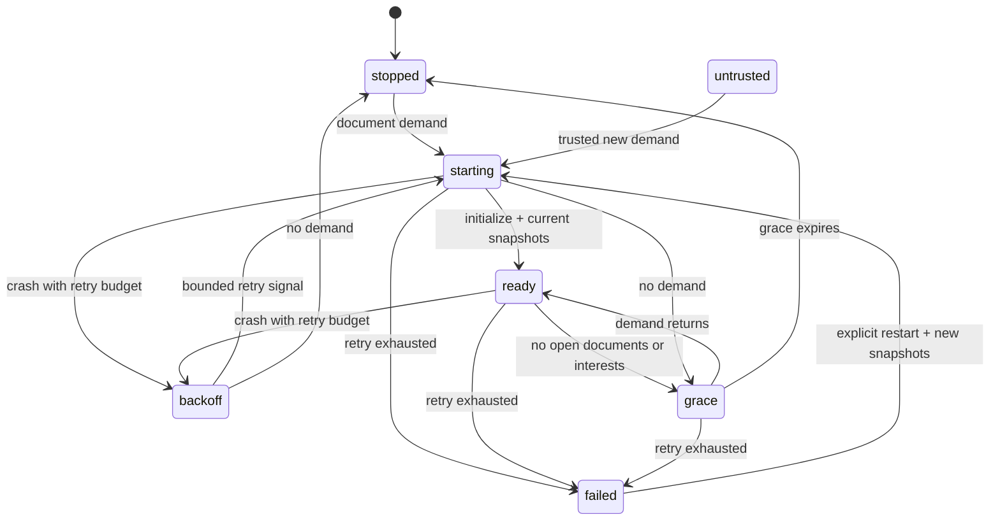

# Host language process lifecycle

`LanguageBroker.layer` requires the accepted D1 services and injected launch resolution.
It does not advertise capabilities or install tools. G2 binds authenticated Client
identity, authoritative checkout registry, prerequisite/version/artifact resolution,
connection loss, trust/config invalidation and event streams. Launch values remain
private. `requestRaw` is the generation/version-fenced formatter seam; feature
requests use P1 schemas. `prepareEdit` must snapshot/revalidate affected files
through the edit coordinator; absent that callback, server applyEdit fails closed.
A forwarded proposal still requires Client acceptance, followed by a generation-bound
server response. The broker never writes a draft or resource edit to disk.

Disconnect/stop from every node enters stopped; revocation enters untrusted.
XState is a pure decider, not an actor with hidden timers. Timers are scoped to
last-interest grace, requests and bounded retry signals. Contexts are ephemeral;
there is no durable event-log copy of unsaved content. Restart/revocation/loss
retires the old generation and its pending requests before cleanup. New generations
require full Client snapshots; no prior edit notification or unknown edit outcome
is retried. Crash retries require refreshed Client demand and consume a maximum
of two automatic retry attempts. Manual restart resets that budget.

Retirement cancels the generation's stderr reader without waiting for its source
finalizer, so an inherited open pipe cannot hold broker cleanup indefinitely.
Transport close likewise cancels stdout without awaiting its source finalizer,
then waits for reader/write settlement and actual owned process stop. Close is
idempotent; its 10 s finalization deadline rejects instead of reporting success.
Failed or pending process stop does not release its process-budget reservation.
The broker keeps actual teardown settlement tracked after that deadline rejects.
POSIX cleanup signals the owned process group; descendants that escape that group
are outside that termination guarantee. Windows cleanup remains untested.
