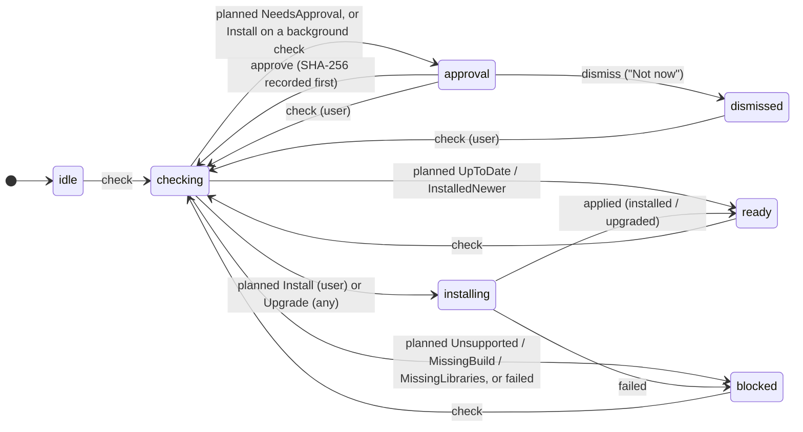

# Machines (main process)

The Hosts in Settings: adding and removing remote Hosts by `~/.ssh/config` alias, each one's install flow, the local Host switch, and the `machines` feed the renderer's Settings → Hosts page (`src/renderer/features/machines/`) shows. Decisions: ENG-179 (SSH, install approval), DESIGN.md "Settings · Hosts (S4)" and "Onboarding".

| File | What |
|---|---|
| `service.ts` | `Machines` (Context.Service): `add`, `update`, `remove`, `check`, `updateDaemon`, `setKeepDaemonsUpToDate`, `setDaemonUpdateOverride`, `approve`, `dismiss`, `startDaemon`, `setLocalEnabled`, `harnesses`, `openSsh` (the macOS Terminal fallback), and `views` (the feed). Runs the probes and uploads, and the background checks. |
| `installFlow.ts` | The install flow as an `xstate/fsm` machine; pure. |
| `views.ts`, `updateFacts.ts` | `MachineView`s from settings, Host list and install flows; `backgroundCheckKey`; the Daemon report's notes. Pure. |
| `remote.ts` | The side effects over ssh: probe and plan, apply (upload, SHA-256 check, `polaris install|upgrade`), restart the service. |
| `sshConfig.ts` | The literal `Host` aliases in `~/.ssh/config`: `Include` followed (globs, `~`, relative to `~/.ssh`, 16 deep), wildcards and negations skipped, `Match` blocks ignored. |
| `approvals.ts` | `<userData>/approvals.json`: approved SHA-256 per alias. |
| `builds.ts` | Where the Daemon builds come from (below). |
| `terminal.ts` | The macOS Terminal fallback for `ssh <alias>` (a `.command` file) when this Mac's local Host is off. Otherwise the renderer runs it, and a Harness's sign-in, in the shell's `HarnessTerminal` slot on a Daemon. |
| `fakeHost.testing.ts` | A fake remote Host for `service.test.ts` and the smoke test; not shipped. |

## The install flow

- **Only the user installs.** A check is `user` (added the Host, Install, Approve, Try again) or `background`. A background check that finds no Daemon asks for approval, even when this build's SHA-256 was approved before: the planner returns `NeedsApproval(background)`, and the machine turns even an `Install` plan on a background check into a question (tested from every state).
- **Upgrades need no new approval**, on any trigger; the outcome (`upgraded`, from → to) stays quiet: "Upgraded to …" in the machine bar for an hour or until opened, its hover card, and the Hosts row for a day. There is no success toast (DESIGN.md, Updates and daemon upgrades).
- **This Mac follows the same rule** when its local Host is the installed system Daemon (`LocalDaemon.installedHome`; never the app's own dev Daemon or a given socket): a connection to an older Daemon, or to any other version under a dev build (`upgradeDue`, D211), upgrades it with `polaris upgrade` (execve, sessions keep running), through the same planner, upload and SHA-256 check run in a local shell (`Ssh.local(home)`). The local Host only ever upgrades: a plan to install becomes a failed check ("no daemon Polaris installed"). `check("local")` runs it on demand (the composer's "Upgrade daemon"). `POLARIS_DESKTOP_LOCAL_HOME` marks a given socket's Daemon as installed in that home (tests: `scripts/oldDaemon.ts`).
- **Keep Daemons up to date** defaults on. `settings.json` stores the app-wide default and optional per-Host overrides (including this Mac); null in IPC restores inheritance. Enabling it checks already connected Hosts. Turning it off suppresses background upgrades, including protocol-mismatch recovery, but still offers the existing first-install approval. A background probe rechecks the policy before applying a plan.
- **Update now** (`machines.updateDaemon`) updates an installed Daemon even when automatic updates are off. It never performs a first install, including with an approved hash. Repeated checks during checking/installing are ignored by the install machine and cannot replace its upload fiber.
- **Facts and progress** travel on the `machines` feed as `MachineView.daemon`: installed and target-specific bundled versions, update availability, effective policy, checking → uploading (actual streamed bytes, throttled to 10 updates/s) → switching (after SHA-256 verification) → done or failed. The last result and epoch-ms time persist in `settings.json`; failures include the SSH failure kind or administrator command. The renderer consumes that result for the quiet captions, with one-shot expiry timers only after an Upgrade. No Daemon idle timer or polling was added.
- **Background checks** run once per occasion (`backgroundCheckKey`): entering Needs Attention for `polaris-not-installed` or `protocol-mismatch`, or a new connection to a Daemon older than the bundled build. Not every 2-minute retry. Build metadata refreshes on connection occasions and explicit checks, including when an earlier manifest was missing.
- "Not now" parks the Host (`dismissed`); background checks leave it parked.
- An ssh failure during the check (`SshError`) is problem `ssh`: the row shows the Connection State's own card (host key, auth) instead.
- Linux linger needing an admin (`linger: "needs-admin"` in the report) becomes the outcome's `adminCommand`, shown as a card with the exact `sudo loginctl enable-linger <user>`.

## Daemon builds

`locateBuilds` picks, in order:

1. `POLARIS_DESKTOP_DAEMON_DIST=<dir>` (tests, the smoke test).
2. **Packaged app:** `<Polaris.app>/Contents/Resources/daemon/` (`process.resourcesPath`), holding `manifest.json` and `<platform>/polaris` exactly as `scripts/build-daemon.ts` writes `apps/daemon/dist`. The packaging step (`bun run --cwd apps/desktop package`) runs `bun run --cwd apps/daemon build` for every platform and copies `apps/daemon/dist` there (`extraResource`), so the app carries all five builds and nothing is downloaded on the Host.
3. **Dev:** the repo's `apps/daemon/dist`. `scripts/dev.ts` builds every target before launch and refreshes them before restart when Daemon/Client/protocol sources change. `scripts/build.ts` also builds every target and copies them into the unpacked app's `Resources/daemon`. An explicit `POLARIS_DESKTOP_DAEMON_DIST` fixture bypasses preparation. A user check can recover missing targets by rebuilding all of them under one build lock; rebuilding only one target at a new version would discard other targets from the manifest. Background reconnects never compile or install a missing Daemon.

## Tests

`installFlow.test.ts` (the machine, with the real planner), `views.test.ts`, `sshConfig.test.ts` (Include, Match, wildcards, globs, depth), `approvals.test.ts`, and `service.test.ts`: `Machines` against a fake Host whose ssh commands run in a local `sh` with HOME at a temp dir (add → approve → install; a reconnect with no Daemon asks and never installs, even approved; a background upgrade; not now; remove forgets approvals; an ssh failure). `updateProgress.test.ts` verifies real streaming byte counts and failed-upload cleanup; `builds.test.ts` checks bundled-source precedence and all-target recovery. End to end: `scripts/daemonUpdatesSmoke.ts` exercises install approval, explicit Update, settings and byte progress over typed IPC; `scripts/smoke.ts` adds `fake-studio` through a stand-in `ssh` on PATH, approves the install into a temp home and waits for it to connect to a real Daemon.
