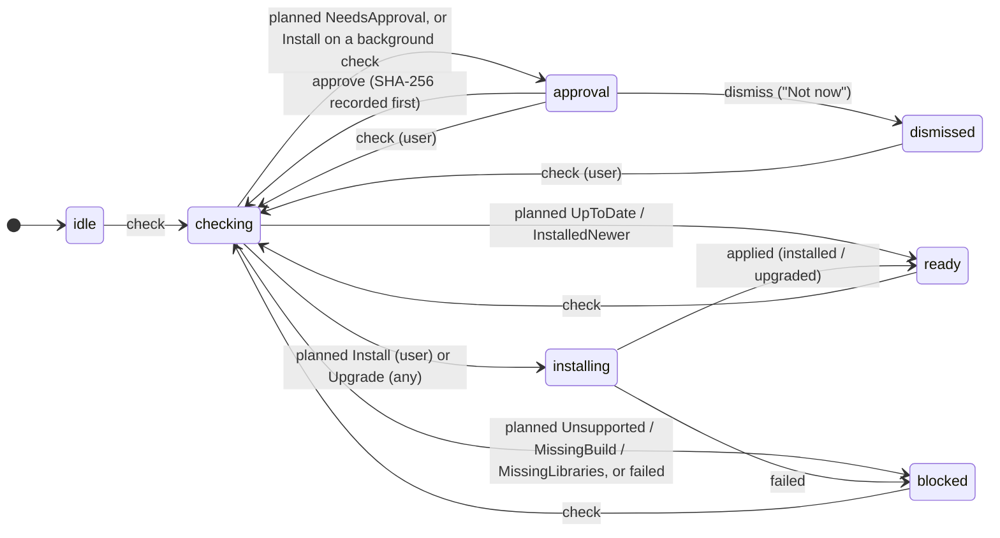

# Machines (main process)

The Hosts in Settings: adding and removing remote Hosts by `~/.ssh/config` alias, each one's install flow, the local Host switch, and the `machines` feed the renderer's Settings → Hosts page (`src/renderer/features/machines/`) shows. Decisions: ENG-179 (SSH, install approval), DESIGN.md "Settings · Hosts (S4)" and "Onboarding".

| File | What |
|---|---|
| `service.ts` | `Machines` (Context.Service): `add`, `update`, `remove`, `check`, `approve`, `dismiss`, `startDaemon`, `setLocalEnabled`, `harnesses`, `openSsh` (the macOS Terminal fallback), and `views` (the feed). Runs the probes and uploads, and the background checks. |
| `installFlow.ts` | The install flow as an `xstate/fsm` machine; pure. |
| `views.ts` | `MachineView`s from settings, Host list and install flows; `backgroundCheckKey`; the Daemon report's notes. Pure. |
| `remote.ts` | The side effects over ssh: probe and plan, apply (upload, SHA-256 check, `polaris install|upgrade`), restart the service. |
| `sshConfig.ts` | The literal `Host` aliases in `~/.ssh/config`: `Include` followed (globs, `~`, relative to `~/.ssh`, 16 deep), wildcards and negations skipped, `Match` blocks ignored. |
| `approvals.ts` | `<userData>/approvals.json`: approved SHA-256 per alias. |
| `builds.ts` | Where the Daemon builds come from (below). |
| `terminal.ts` | The macOS Terminal fallback for `ssh <alias>` (a `.command` file) when this Mac's local Host is off. Otherwise the renderer runs it, and a Harness's sign-in, in the shell's `HarnessTerminal` slot on a Daemon. |
| `fakeHost.testing.ts` | A fake remote Host for `service.test.ts` and the smoke test; not shipped. |

## The install flow

- **Only the user installs.** A check is `user` (added the Host, Install, Approve, Try again) or `background`. A background check that finds no Daemon asks for approval, even when this build's SHA-256 was approved before: the planner returns `NeedsApproval(background)`, and the machine turns even an `Install` plan on a background check into a question (tested from every state).
- **Upgrades need no new approval**, on any trigger; the outcome (`upgraded`, from → to) shows under the row.
- **Background checks** run once per occasion (`backgroundCheckKey`): entering Needs Attention for `polaris-not-installed` or `protocol-mismatch`, or a new connection to a Daemon older than the bundled build. Not every 2-minute retry.
- "Not now" parks the Host (`dismissed`); background checks leave it parked.
- An ssh failure during the check (`SshError`) is problem `ssh`: the row shows the Connection State's own card (host key, auth) instead.
- Linux linger needing an admin (`linger: "needs-admin"` in the report) becomes the outcome's `adminCommand`, shown as a card with the exact `sudo loginctl enable-linger <user>`.

## Daemon builds

`locateBuilds` picks, in order:

1. `POLARIS_DESKTOP_DAEMON_DIST=<dir>` (tests, the smoke test).
2. **Packaged app:** `<Polaris.app>/Contents/Resources/daemon/` (`process.resourcesPath`), holding `manifest.json` and `<platform>/polaris` exactly as `scripts/build-daemon.ts` writes `apps/daemon/dist`. The packaging step (not built yet) runs `bun run --cwd apps/daemon build` for every platform and copies `apps/daemon/dist` there (`extraResources`), so the app carries all five builds and nothing is downloaded on the Host.
3. **Dev:** the repo's `apps/daemon/dist`. A platform missing there is built on demand with `bun scripts/build-daemon.ts <platform>` (a minute or so; the row says so), only on a check the user started.

## Tests

`installFlow.test.ts` (the machine, with the real planner), `views.test.ts`, `sshConfig.test.ts` (Include, Match, wildcards, globs, depth), `approvals.test.ts`, and `service.test.ts`: `Machines` against a fake Host whose ssh commands run in a local `sh` with HOME at a temp dir (add → approve → install; a reconnect with no Daemon asks and never installs, even approved; a background upgrade; not now; remove forgets approvals; an ssh failure). End to end: `scripts/smoke.ts` adds `fake-studio` through a stand-in `ssh` on PATH, approves the install into a temp home and waits for it to connect to a real Daemon.
