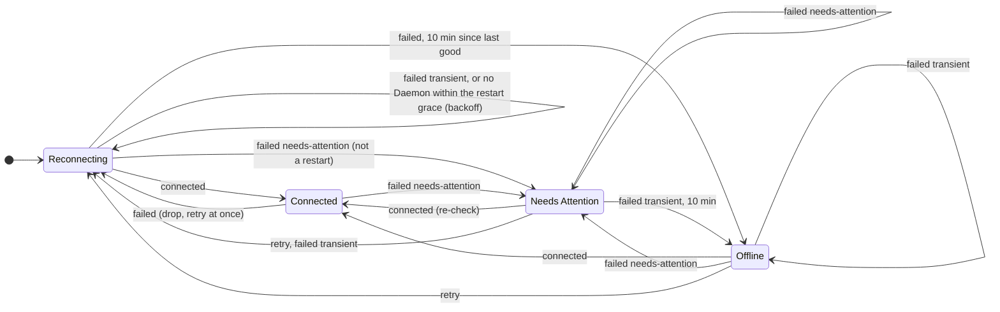

# @polaris/client

The Client runtime: one `HostConnection` per Host, many at once in a `HostRegistry`, each with its Connection State and resumable streams. Decisions: ENG-175 (wire) and ENG-179 (SSH). The install / upgrade flow is in `src/install/` (separate README).

| File | What |
|---|---|
| `HostConnection.ts` | Connect, `hello`, the reconnect loop (runs the Connection State machine), `subscribeHost` / `subscribeSession`, `withBlob`. |
| `connection.ts` | The Connection State machine (`xstate/fsm`): `ReconnectPolicy`, `DEFAULT_POLICY`, which state and how long to wait after every attempt. |
| `connection.testing.ts` | Its test model for `xstate/graph` (`@polaris/client/testing`); not used in production. |
| `HostRegistry.ts` | `HostRegistry` service: add / remove / get Hosts, `hosts` as a `SubscriptionRef`. |
| `rpc.ts` | effect/rpc client `Protocol` over the framed Wire (`packages/protocol/src/wire.ts`), ping keepalive while a reply is due. |
| `resume.ts` | `makeFeed`: one upstream subscription, multicast, cached, resumed after reconnect. |
| `transport.ts` | Transports: a spawned command's stdio (`ssh … polaris bridge`) or the local Unix socket. `Connector` is injectable. |
| `ssh.ts` | The `ssh` argv. |
| `failures.ts` | `ConnectFailure` and the stderr / exit-status classifier. |

## Usage

```ts
const registry = yield* HostRegistry
const studio = yield* registry.add({
  key: "studio",
  name: "Mac Studio",
  target: { _tag: "Ssh", alias: "studio" },          // anything ~/.ssh/config knows
  identity: { name: "Polaris", version, deviceLabel: "MacBook Pro", capabilities },
})
studio.changes            // Stream<ConnectionStatus>: state, failure reason, next attempt, last HostInfo
studio.subscribeHost      // Stream<HostStreamItem>, survives reconnects
const s = yield* studio.session                         // or awaitSession
const read = yield* s.client["files.read"]({ path, offset: null, length: null })
if (read.content._tag === "Blob") yield* s.blobs.take(read.content.blobId)
yield* studio.withBlob(bytes, (blobId, s) => s.client["attachments.stage"]({ ..., blobId }))
```

Local Host: `target: { _tag: "Local", socketPath }` connects to the socket directly. Tests pass `connector: spawnTransport(["bun", "apps/daemon/src/main.ts", "bridge"], { env })` in place of ssh.

## SSH

`ssh -o BatchMode=yes -o ControlMaster=auto -o ControlPath=~/.polaris/ssh/%C -o ControlPersist=10m -o Compression=yes -o ServerAliveInterval=15 -o ServerAliveCountMax=3 -o ConnectTimeout=15 -o ForwardAgent=no -o ClearAllForwardings=yes -o RequestTTY=no -T -e none -- <alias> polaris bridge`

The ControlMaster is private to Polaris (its own directory, mode 0700), so it never interferes with the user's multiplexing. Everything else (HostName, User, ProxyJump, keys) comes from `~/.ssh/config`. Agent forwarding is off unless the Host's `forwardAgent` toggle is on; then the bridge keeps `~/.polaris/agent.sock` on the Host pointing at the forwarded agent.

## Connection State

| Situation | State | Retry |
|---|---|---|
| Before the first connection, after a drop, transient failures (unreachable, timeout, lost) | Reconnecting | exponential backoff 0.5 s → 2 min (×2, ±20% jitter); the first retry after a drop is immediate |
| Host key changed / unknown, auth failed (incl. a password or 2FA prompt), bad ssh config, ssh missing | Needs Attention | none until `retryNow` (never hammer sshd with failing auth) |
| `polaris` not installed, no Daemon running, protocol mismatch | Needs Attention | every 2 min, or `retryNow` after the install / upgrade flow |
| No Daemon running within 30 s of a drop | Reconnecting | backoff (a Daemon restart or upgrade) |
| Transient failures for 10 min since the last good connection | Offline | every 10 min, or `retryNow` |

The policy is a pure machine, `connectionMachine` in `connection.ts`, built with `xstate/fsm` (XState v6's flat transition table, ~3 KB bundled with its handlers, no runtime). `HostConnection` owns the attempts and the timers: it feeds the machine `connected` when `hello` succeeds, `failed { failure, now, jitter }` when an attempt fails or a connection ends, and `retry` for `retryNow`, and then waits the `delay` the machine put in its context (`null`: until `retryNow`). Time and jitter come in with the events (`Clock` and `Math.random` in production), so the machine is deterministic.



**Tests**: `connection.test.ts` checks the machine against the reconnect loop's decision as it was before the machine (kept in the test as the oracle) from every reachable state, with the default policy and jitter at several times. `apps/daemon/src/transport/connection.graph.test.ts` walks the test model with `xstate/graph` and replays every path against a real `HostConnection` talking to an in-process Daemon server, with a scripted connector (each attempt connects or fails with a given reason; a live connection can be dropped) and a `TestClock`: 155 shortest paths (one per state of the model) and 580 paths, one per state-changing transition. After every step the status (Connection State, attempt, failure reason, time to the next attempt) and what the loop is doing (waiting on an attempt, waiting to retry, connected) must match.

`ConnectionStatus.failure` carries the reason and a one-line detail (usually the relevant ssh stderr line). The last `HostInfo` stays in the status while not connected so the UI can dim the Host. A dead link is detected by ssh keepalives (~45 s, answered by sshd, so they never wake the Daemon) and, while a request other than a stream awaits its reply, by the RPC ping (no traffic for 3 × 15 s). A Client that only holds subscriptions sends nothing: any JS the Daemon runs, even answering a ping, keeps Bun waking ~10 times a second for up to ~30 s, so a periodic ping would keep an idle Daemon awake for good.

## Resume

`subscribeHost` and `subscribeSession(sessionId)` are backed by one upstream subscription per stream, shared by every local subscriber. After a reconnect the feed resubscribes with `afterSequence` = the last sequence it saw and drops events at or below it; on the host stream (gapless) a gap makes it reopen. The feed keeps the last Snapshot and the events after it (up to 10 000, then it asks for a fresh Snapshot), so a new subscriber is painted from the cache immediately and then revalidated. Consumers must accept a Snapshot at any point and treat it as a reset. `Delta` items are passed through, not cached. A session stream fails only with `NotFound`.

## Known gaps / TODO

- Session feeds keep up to 32 idle caches; no persistence of caches across app restarts yet (a seed option on `makeFeed` would do it).
- Deltas for an item in progress are not replayed after a reconnect; the Turn catches up at its next sequenced event.
- The remote command is `polaris bridge` on the user's PATH; the install flow may need `~/.polaris/bin/current/polaris bridge` (`SshOptions.remoteCommand`).
- The ssh stderr classifier is based on OpenSSH messages; other clients (e.g. Tailscale SSH banners) may land in the generic "connection-lost".
