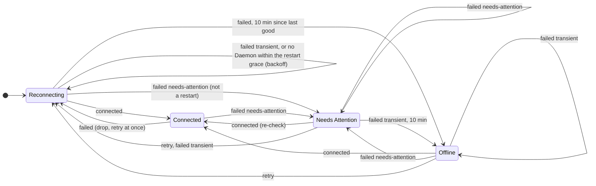

# @polaris/client

The Client runtime: one `HostConnection` per Host, many at once in a `HostRegistry`, each with its Connection State and resumable streams. Decisions: ENG-175 (wire) and ENG-179 (SSH). The install / upgrade flow is in `src/install/` (separate README).

| File | What |
|---|---|
| `HostConnection.ts` | Connect, `hello`, the reconnect loop (runs the Connection State machine), `subscribeHost` / `subscribeSession`, `withBlob`. |
| `connection.ts` | The Connection State machine (`xstate/fsm`): `ReconnectPolicy`, `DEFAULT_POLICY`, which state and how long to wait after every attempt. |
| `connection.testing.ts` | Its test model for `xstate/graph` (`@polaris/client/testing`); not used in production. |
| `HostRegistry.ts` | `HostRegistry` service: add / remove / get Hosts, `hosts` as a `SubscriptionRef`. |
| `rpc.ts` | effect/rpc client `Protocol` over the framed Wire (`packages/protocol/src/wire.ts`), ping keepalive while a reply is due. |
| `resume.ts` | `makeFeed`: one upstream subscription, multicast, cached, resumed after reconnect. |
| `transport.ts` | Transports: a spawned command's stdio (`ssh … polaris bridge`) or the local Unix socket. `Connector` is injectable. |
| `ssh.ts` | The `ssh` argv. |
| `failures.ts` | `ConnectFailure` and the stderr / exit-status classifier. |
| `usage/` | Usage cost estimates (`@polaris/client/usage`): the price book, per-bucket cost, and the summaries the Usage view shows. See "Usage cost" below. |

## Usage

```ts
const registry = yield* HostRegistry
const studio = yield* registry.add({
  key: "studio",
  name: "Mac Studio",
  target: { _tag: "Ssh", alias: "studio" },          // anything ~/.ssh/config knows
  identity: { name: "Polaris", version, deviceLabel: "MacBook Pro", capabilities },
})
studio.changes            // Stream<ConnectionStatus>: state, failure reason, next attempt, last HostInfo
studio.subscribeHost      // Stream<HostStreamItem>, survives reconnects
const s = yield* studio.session                         // or awaitSession
const read = yield* s.client["files.read"]({ path, offset: null, length: null })
if (read.content._tag === "Blob") yield* s.blobs.take(read.content.blobId)
yield* studio.withBlob(bytes, (blobId, s) => s.client["attachments.stage"]({ ..., blobId }))
```

Local Host: `target: { _tag: "Local", socketPath }` connects to the socket directly. Tests pass `connector: spawnTransport(["bun", "apps/daemon/src/main.ts", "bridge"], { env })` in place of ssh.

## SSH

`ssh -o BatchMode=yes -o ControlMaster=auto -o ControlPath=~/.polaris/ssh/%C -o ControlPersist=10m -o Compression=yes -o ServerAliveInterval=15 -o ServerAliveCountMax=3 -o ConnectTimeout=15 -o ForwardAgent=no -o ClearAllForwardings=yes -o RequestTTY=no -T -e none -- <alias> ~/.polaris/bin/current/polaris bridge`

The remote command defaults to the installed Daemon (`DEFAULT_REMOTE_COMMAND`), because `polaris` is not on PATH in a non-interactive SSH shell; `SshOptions.remoteCommand` overrides it per Host.

The ControlMaster is private to Polaris (its own directory, mode 0700), so it never interferes with the user's multiplexing. Everything else (HostName, User, ProxyJump, keys) comes from `~/.ssh/config`. Agent forwarding is off unless the Host's `forwardAgent` toggle is on; then the bridge keeps `~/.polaris/agent.sock` on the Host pointing at the forwarded agent.

## Connection State

| Situation | State | Retry |
|---|---|---|
| Before the first connection, after a drop, transient failures (unreachable, timeout, lost) | Reconnecting | exponential backoff 0.5 s → 2 min (×2, ±20% jitter); the first retry after a drop is immediate |
| Host key changed / unknown, auth failed (incl. a password or 2FA prompt), bad ssh config, ssh missing | Needs Attention | none until `retryNow` (never hammer sshd with failing auth) |
| `polaris` not installed, no Daemon running, protocol mismatch | Needs Attention | every 2 min, or `retryNow` after the install / upgrade flow |
| No Daemon running within 30 s of a drop | Reconnecting | backoff (a Daemon restart or upgrade) |
| Transient failures for 10 min since the last good connection | Offline | every 10 min, or `retryNow` |

The policy is a pure machine, `connectionMachine` in `connection.ts`, built with `xstate/fsm` (XState v6's flat transition table, ~3 KB bundled with its handlers, no runtime). `HostConnection` owns the attempts and the timers: it feeds the machine `connected` when `hello` succeeds, `failed { failure, now, jitter }` when an attempt fails or a connection ends, and `retry` for `retryNow`, and then waits the `delay` the machine put in its context (`null`: until `retryNow`). Time and jitter come in with the events (`Clock` and `Math.random` in production), so the machine is deterministic.



**Tests**: `connection.test.ts` checks the machine against the reconnect loop's decision as it was before the machine (kept in the test as the oracle) from every reachable state, with the default policy and jitter at several times. `apps/daemon/src/transport/connection.graph.test.ts` walks the test model with `xstate/graph` and replays every path against a real `HostConnection` talking to an in-process Daemon server, with a scripted connector (each attempt connects or fails with a given reason; a live connection can be dropped) and a `TestClock`: 155 shortest paths (one per state of the model) and 580 paths, one per state-changing transition. After every step the status (Connection State, attempt, failure reason, time to the next attempt) and what the loop is doing (waiting on an attempt, waiting to retry, connected) must match.

`ConnectionStatus.failure` carries the reason and a one-line detail (usually the relevant ssh stderr line). The last `HostInfo` stays in the status while not connected so the UI can dim the Host. A dead link is detected by ssh keepalives (~45 s, answered by sshd, so they never wake the Daemon) and, while a request other than a stream awaits its reply, by the RPC ping (no traffic for 3 × 15 s). A Client that only holds subscriptions sends nothing: any JS the Daemon runs, even answering a ping, keeps Bun waking ~10 times a second for up to ~30 s, so a periodic ping would keep an idle Daemon awake for good.

## Resume

`subscribeHost` and `subscribeSession(sessionId)` are backed by one upstream subscription per stream, shared by every local subscriber. After a reconnect the feed resubscribes with `afterSequence` = the last sequence it saw and drops events at or below it. Neither stream is gapless (the host stream leaves out session-only events such as `TurnItemCompleted` and `CheckpointRecorded`), and none needs a gap check: a subscriber the Daemon drops for falling behind has its stream ended, never skipped, and the feed resumes from its last sequence. A reopen that makes no progress backs off (25 ms, doubling up to 5 s), so a feed can never resubscribe in a tight loop. The feed keeps the last Snapshot and the events after it (up to 10 000, then it asks for a fresh Snapshot), so a new subscriber is painted from the cache immediately and then revalidated. Consumers must accept a Snapshot at any point and treat it as a reset. `Delta` items are passed through, not cached. A session stream fails only with `NotFound`.

## Known gaps / TODO

- Session feeds keep up to 32 idle caches; no persistence of caches across app restarts yet (a seed option on `makeFeed` would do it).
- Deltas for an item in progress are not replayed after a reconnect; the Turn catches up at its next sequenced event.
- The ssh stderr classifier is based on OpenSSH messages; other clients (e.g. Tailscale SSH banners) may land in the generic "connection-lost".

## Usage cost

`@polaris/client/usage` estimates what Usage (CONTEXT.md) would cost at API prices (ENG-207; decisions in ENG-199 Q18 and Q26). Estimates are made in the Client, which fetches the prices itself, so a Host never needs network access for them. No credentials are involved.

| File | What |
|---|---|
| `prices.ts` | The price table: LiteLLM's `model_prices_and_context_window.json` first, then models.dev for Models LiteLLM lacks (both MIT). It is normalized to USD per token: `Rates` for input, output, cache read, five-minute cache write and one-hour cache write, plus a Model's long-context rates and its fast / priority rates. `resolvePrice` finds a Model's rates. |
| `fast-multipliers.ts` | How much fast mode / the priority tier costs over standard, for Models whose list has no priority rates. Adapted from ccusage@0dd85c1 (MIT). |
| `PriceBook.ts` | The `PriceBook` service: `current` (the cached fetch, else the bundled snapshot), `refresh` (fetch both lists, cache to `cacheFile`), `refreshIfStale` (after a day; keeps the old table if the fetch fails). |
| `prices.snapshot.json` | The bundled table, for offline use and before the first fetch. Refresh it with `bun run --cwd packages/client prices` (generated; the formatter skips it). |
| `cost.ts` | `bucketCost(bucket, table)`: the cost of one `UsageBucket`. |
| `summary.ts` | `summarizeUsage({ hosts, prices, timeZone })`: what the Usage view shows. |

**Rules** (checked against ccusage below):

- **A cost the Harness reported wins** for the tokens it covers (`reportedCost`). Only the rest is estimated.
- **Per-token pricing.** A five-minute cache write is priced at the list's `cache_creation` rate. A one-hour write uses LiteLLM's `…_above_1hr` rate, else 2× input. Where a list omits a cache rate, ccusage's defaults apply: writes 1.25× input, reads 0.1× input. Reasoning is billed as output, so it is inside `output`.
- **Long context.** A Model whose list has long-context rates (LiteLLM's `…_above_200k_tokens` / `…_above_272k_tokens`, or a models.dev context tier) has its bucket's `longContext` tokens at that threshold priced entirely at the long rates. That is how Anthropic and OpenAI bill a long request. The Daemon tracks 200k and 272k; a Model with another threshold is priced at its base rates.
- **Fast mode.** A `<model>-fast` id (Claude fast mode, the Codex priority tier) uses the list's priority rates, else the base rates times a known multiplier.
- **Unknown Models are never guessed.** A Model no list prices, or a fast Model with no priority rates and no known multiplier, contributes `unpricedTokens` and is named in `unpricedModels`. Its cost is left out.
- **Model ids.** Provider-prefixed ids (`anthropic/claude-…`) match the plain id. LiteLLM's reseller keys (`bedrock/…`, `openrouter/…`) are left out, and models.dev lists the Model's vendor first.

**Summaries.** `summarizeUsage` takes each Host's buckets (`usage.query`) and gives:

- The total, and the part that ran in Agent Sessions (`polaris`: the share through Polaris).
- Totals by Harness, Model, Host, and local day. A bucket goes to the day, in `timeZone`, its hour starts in.
- `pricesFetchedAt`, to show with every estimate.

Each total has `tokens`, `cost` (`usd` = `reportedUsd` + `estimatedUsd`, plus `unpricedTokens`), and `unpricedModels`. The UI labels every cost as an estimate, and labels subscription Usage "API-equivalent", never as money spent (ENG-199 Q18).

**Checked against ccusage.** `bun --cwd apps/daemon scripts/usage-cost-vs-ccusage.ts` builds a fresh Usage index from this Host's logs and prices it here. It then compares, per UTC day, with ccusage 20.0.26 running online (both sides on today's lists). On 2026-09-30 on this Mac:

- **Claude:** $4,339.10 over 28 days, the same as ccusage to the cent.
- **Codex:** $4,202.95 against ccusage's $4,290.89. The $87.94 gap is exactly `codex-auto-review` (245M tokens). ccusage prices it from a hand-kept timeline of which Model the alias meant (gpt-5.4, then gpt-5.6-luna); here it is unpriced.

